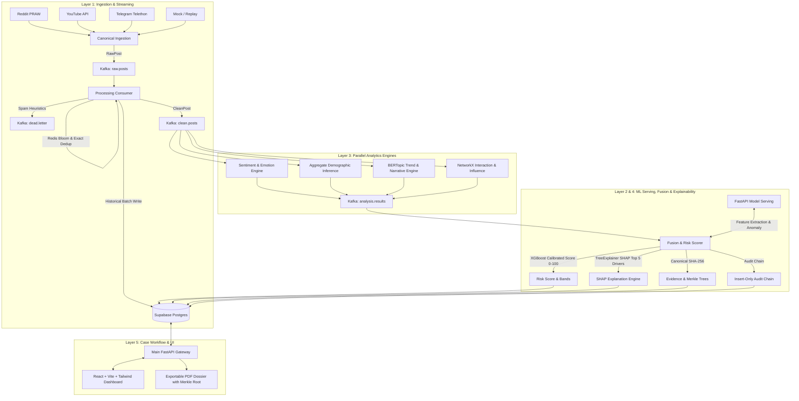

# SociSenti: Explainable Social Intelligence & Risk Scoring Platform

[](https://www.python.org/downloads/release/python-3119/)
[](https://fastapi.tiangolo.com)
[](https://supabase.com)
[](LICENSE)

An enterprise-grade, explainable social-media intelligence and risk scoring platform for compliance teams and analysts. It ingests public multi-platform social data (Reddit, YouTube, Telegram), runs four parallel analytical engines, fuses multimodal signals into a calibrated 0-100 risk score with local SHAP feature attributions, preserves tamper-evident evidence trails (SHA-256 hash chains + Merkle trees), and empowers analysts through an interactive dashboard and compliance-ready PDF case dossiers.

---

## Architecture & Data Flow



---

## Key Design & Infrastructure Choices

- **Supabase PostgreSQL & pgvector:** Managed Postgres with Row Level Security (RLS) policies for `analyst`, `reviewer`, and `admin` roles. Uses native monthly range partitioning/BRIN indexes, continuous aggregate replacement materialized views (`mv_hourly_post_volume`, `mv_hourly_sentiment`), and `vector(384)` with HNSW indexes for semantic post similarity.
- **Why no TimescaleDB:** TimescaleDB hypertables are replaced with standard PostgreSQL native range partitioning, BRIN time-series indexes, and materialized views to guarantee 100% cloud Supabase compatibility.
- **Privacy First:** All author identifiers are hashed with salted SHA-256 at the ingestion boundary before any database or queue writes. Demographics are strictly aggregate-only (minimum cohort size $k \ge 50$, cell suppression, and Laplace noise).
- **Explainable AI:** Every prediction outputs a calibrated 0-100 score, Low/Medium/High risk band, confidence intervals, top 5 SHAP feature attributions, and human-readable natural language justifications.
- **Tamper Evidence:** Audit logs are strictly insert-only (database triggers block UPDATE and DELETE) using cryptographic hash chains (`prev_hash` + `row_hash`). Evidence items are stored with SHA-256 fingerprints and verifiable Merkle inclusion proofs.

---

## Free-Tier & Capacity Limits

| Resource | Free-Tier Budget | Optimization in SociSenti |
|---|---|---|
| Supabase DB Space | 500 MB | Author hashing, compact JSONB, vacuuming, 5,000–50,000 rows sample capacity |
| Postgres Connections | 60 (Direct) / 200 (Pooler) | Ingestion workers batch write (500–1000 rows) via Transaction Pooler |
| Storage Bucket | 1 GB | Compressed PDF reports and JSON evidence snapshots |

---

## Quickstart (Local Development)

### 1. Prerequisites
- Python 3.11+
- Node.js 18+ (`npm` / `npx`)
- Docker & Docker Compose (optional for local mock mode; required for Kafka/Redis containers)

### 2. Setup & Environment
```bash
# Clone and enter repo
cd "Soci Senti"

# Copy environment variables
cp .env.example .env
```

### 3. Start Infrastructure & Database
```bash
# Using Makefile
make up

# Or on Windows PowerShell:
.\run.ps1 up
```

### 4. Seed Synthetic Dataset (5,200 records)
```bash
# Using Makefile
make seed

# Or on Windows PowerShell:
.\run.ps1 seed
```

### 5. Run Test Suite
```bash
# Using Makefile
make test

# Or on Windows PowerShell:
.\run.ps1 test
```

### 6. Run Replay Demo
```bash
# Using Makefile
make demo

# Or on Windows PowerShell:
.\run.ps1 demo
```

---

## Model Limitations & Synthetic Labels Disclosure
> [!NOTE]
> Ground-truth labels for malicious social influence campaigns, financial fraud, and coordinated inauthentic behavior (CIB) are proprietary and scarce. The models in this MVP are trained using a reproducible, seeded synthetic generator and weak-supervision labeling heuristics. In production, these should be retrained on domain-verified analyst annotations.

---

## Roadmap (v2 Scope)
The following modules have clean interfaces with documented stubs:
- `XConnector` and `InstagramConnector` (`services/ingestion/connectors/`)
- `GraphSAGEEmbedder` for deep inductive graph neural networks (`services/analytics/network/`)
- `AnchorService` for decentralized public ledger/blockchain Merkle anchoring (`services/fusion/integrity/`)
- `AICopilotService` for natural-language SNA and investigative querying (`services/api/routers/copilot.py`)
